# terraform-tgw-client-vpn-sample

Terraform で TGW や Client VPN を作成するサンプル。

- 共用 VPC に TGW を配置
- 移行 VPC と開発 VPC はルーティングされない構成
- 共用 VPC に Client VPN エンドポイントを配置
- 共用 VPC に VPC エンドポイントは集約
  - プライベートホストゾーンを作成
  - 移行 VPC と開発 VPC にもホストゾーンを関連付け